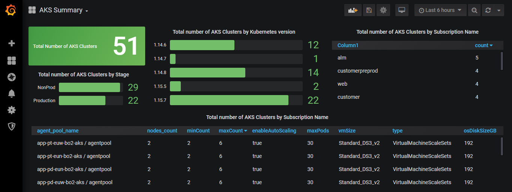

## Azure Kubernetes clusters summary in Grafana

When managing multiple **kubernetes** clusters / **AKS** in azure, it is good to know the state / size of all kubernetes clusters in single place like grafana dashboard. In this post, I will be explaining the easiest way to get the state of all the clusters across all of your **Azure** subscriptions in Grafana.

We are going to use [**Azure Resource Graph**](https://azure.microsoft.com/en-us/features/resource-graph/) to get the results. To get the azure resource graph results in grafana, I am using [Grafana Azure Datasource](https://github.com/yesoreyeram/grafana-azure-datasource) plugin. You can also use the queries wihtout grafana in Azure dashboard.

Below is the screenshot of the Grafana dashboard.



### Pre-Requisites

* Reader access to the necessary subscription ( in case of using with Grafana, need a SPN with Reader access to the subscription )
* [Grafana](https://grafana.com/) 5.2.x or newer
* [Grafana Azure Datasource](https://github.com/yesoreyeram/grafana-azure-datasource) plugin

### Setup

Once installed the Grafana and Grafana azure data source plugin, You need to configure the SPN as the datasource for Grafana. Then like any other grafana dashboard, you can query the Azure Resoruce Graph in grafana.

## Azure Resource Graph queries

Below is the list of azure resource graph queries I am using in the dashboard.

####  Total Number of AKS Clusters

```py
resources
| where type contains "microsoft.containerservice/managedclusters"
| count
```

#### Total number of AKS Clusters by Kubernetes version

```py
resources 
| where type contains "microsoft.containerservice/managedclusters" 
| extend cluster_version = tostring(properties.kubernetesVersion)
| summarize count = count() by cluster_version
| order by cluster_version asc
```

####  Total Number of AKS Clusters by Subscription

```py
ResourceContainers  
| where type=="microsoft.resources/subscriptions"  
| project SubscriptionName = name, subscriptionId 
| join ( 		
        resources 
        | where type contains "microsoft.containerservice/managedclusters"
        | summarize number_of_resosurces = count() by subscriptionId	
    ) on subscriptionId  
| project-away subscriptionId,subscriptionId1 
| project SubscriptionName, count = number_of_resosurces
| order by ["count"] desc
```

#### Total number of AKS Clustes grouped by tags

Following query assumes you have either `stage` or `Stage` tag in your AKS Clster and trying to summarize the count by that tag value.

```py
resources
| where type contains "microsoft.containerservice/managedclusters" 
| extend stage = strcat(tags.stage, tags.Stage)
| extend stage = iff(isempty(stage), 'Unknown', stage)
| summarize count = count() by stage
```

#### Cluster Size information by Agent Pool

```py
resources
| where type contains "microsoft.containerservice/managedclusters"
| mv-expand agentPoolProfile = properties.agentPoolProfiles
| extend agentPoolId = strcat(name," / ", agentPoolProfile.name)
| project 
    agent_pool_name = agentPoolId , 
    nodes_count = agentPoolProfile["count"], 
    minCount = agentPoolProfile["minCount"],
    maxCount = agentPoolProfile["maxCount"],
    enableAutoScaling = agentPoolProfile["enableAutoScaling"],
    maxPods = agentPoolProfile["maxPods"], 
    vmSize = agentPoolProfile["vmSize"], 
	poolType = agentPoolProfile["type"],
    osDiskSizeGB = agentPoolProfile["osDiskSizeGB"]
```

#### Total Nodes count

```py
resources
| where type contains "microsoft.containerservice/managedclusters"
| mv-expand agentPoolProfile = properties.agentPoolProfiles
| summarize total_nodes = sum(toint(agentPoolProfile["count"]))
```

#### Total number of agent pools and nodes

```py
resources
| where type contains "microsoft.containerservice/managedclusters"
| mv-expand agentPoolProfile = properties.agentPoolProfiles
| summarize total_agent_pools = count(), 
            total_nodes = sum(toint(agentPoolProfile["count"])) 
        by cluster_name = name
| order by total_nodes desc
```

#### Clusters and their corresponding Log Analytics workspace

```py
resources
| where type contains "microsoft.containerservice/managedclusters"
| extend la_id = properties.addonProfiles.omsagent.config.logAnalyticsWorkspaceResourceID
| project name, Log_Anlytics_ID = split(la_id,"/")[8]
```

<Signature />